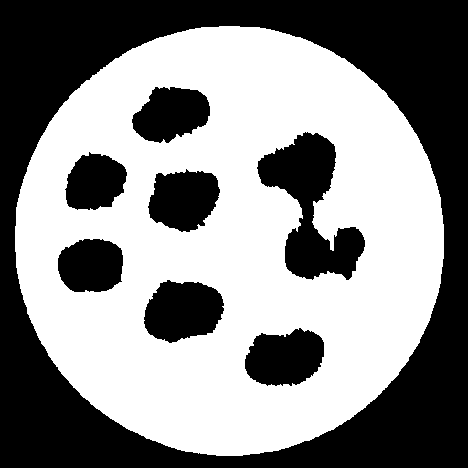
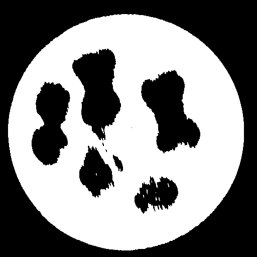
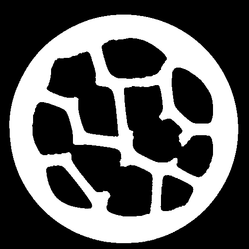
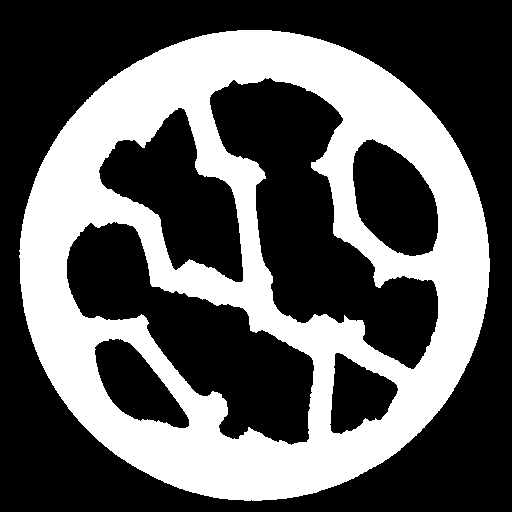
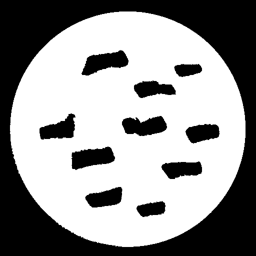
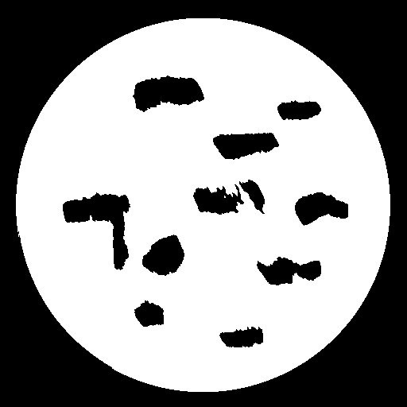
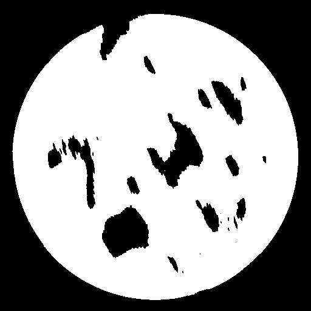

# CIL-HTC2022-Algo1

## Authors:
- Gemma Fardell (STFC), United Kingdom
- Jakob Sauer Jørgensen (DTU), Denmark
- Laura Murgatroyd (STFC), United Kingdom
- Evangelos Papoutsellis (STFC, Finden), United Kingdom
- Edoardo Pasca (STFC), United Kingdom

## Addresses
STFC: 
United Kingdom Research and Innovation
Scientific Computing Department of Science Technology Facilities Council
Rutherford Appleton Laboratory
Harwell Campus
Didcot
OX11 0QX

DTU: 
Technical University of Denmark,
Department of Applied Mathematics and Computer Science
Richard Petersens Plads 
Building 324
2800 Kgs. Lyngby
Denmark

Finden: 
Building R71,
Rutherford Appleton Laboratory,
Harwell,
Oxford,
OX11 0QX

## Description of the algorithm

This is an entry for the [HTC2022 competition](https://www.fips.fi/HTC2022.php).
The algorithm in `algo.py` is developed using [CIL](https://www.ccpi.ac.uk/cil), a toolkit for tomographic imaging and optimisation.
The main steps of the algorithm is:
1. Pre-processing: renormalisation, single material beam hardening correction, zero padding
2. Generation of pixelwise lower and upper bound circular masks (mask is fitted to the provided data)
3. Regularised iterative reconstruction algorithm using tools from CIL: Least-squares data fidelity with TV regularisation
4. Post-processing: segmentation of the reconstruction with multi-Otsu threshold

## Installation instructions

Installation instructions, including any requirements.

```
conda env create --file environment.yml
```

## Usage instructions.

```
conda activate htc-22-cil-algo1
python main.py path/to/input/files path/to/output/files 3
```

## Examples

Examples of reconstructing the example datasets, where we have limited the angles to 90, 60 and 30 degree ranges. The 'ref' column is the given segmented result from the full dataset.

|   	|  Ref	|  90 	| 60 	| 30 	|
|----------	|-----	|---	|---	|---	|
|   **ta**	| 	| 	|   	|   	|   
|   **tb**	|   	|  	|   	|   	|   
|   **tc**	|   	| 	|   	|   	|   
|   **td**	|   	| 	|   	|   	|   

Scores for each sample and angle:

|   	|  90 	| 60 	| 30 	|
|-----	|---	|---	|---	|
|**ta**	|0.973|	0.953|	0.891|
|**tb**|0.932	|0.884	|0.759|
|**tc**	|0.951|	0.901|	0.795|
|**td**	|0.960	|0.958|	0.939|

## Repository content
- utils.py
- algo.py
- main.py
- environment.yml
- README.md
- recalc_score.py
- test_data
  - htc2022_ta_full_recon_fbp_seg.png
  - htc2022_ta_sparse_example.mat
- results
  - htc2022_ta_sparse_example.png
  - AR30
    - htc2022_ta_full.png 
    - htc2022_tb_full.png
    - htc2022_tc_full.png
    - htc2022_td_full.png
  - AR60
    - htc2022_ta_full.png 
    - htc2022_tb_full.png
    - htc2022_tc_full.png
    - htc2022_td_full.png
  - AR90
    - htc2022_ta_full.png 
    - htc2022_tb_full.png
    - htc2022_tc_full.png
    - htc2022_td_full.png 


## License
All files in the repository come with the [Apache-v2.0](https://www.apache.org/licenses/LICENSE-2.0) license unless differently specified.
